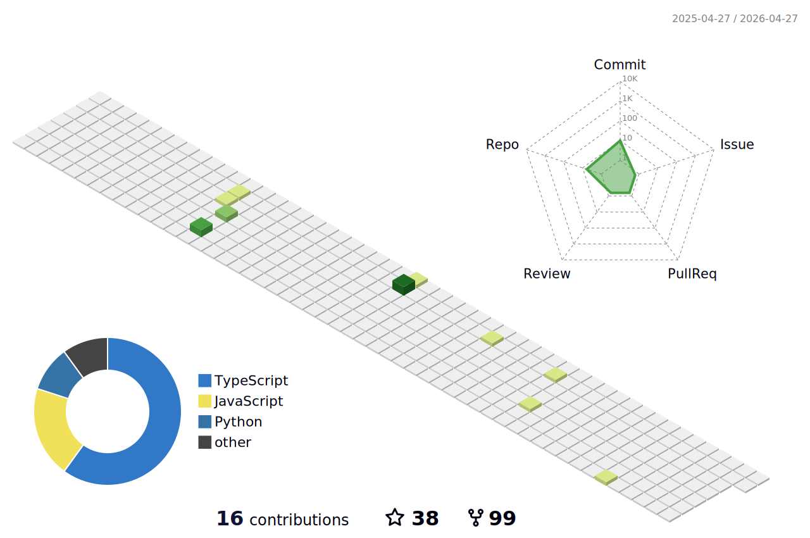

<h1 align="center">Hey there!👋, I'm Anvansh Singh</h1>
<h3 align="center">A passionate Full Stack developer from India</h3>

  

- 🌱 I’m currently learning about **Kubernetes**

- 🤝 I’m looking for help with [DDeploy](https://github.com/RyanWalker277/ddeploy), [Aptigrate](https://github.com/RyanWalker277/Aptigrate) and [PyOGC](https://github.com/RyanWalker277/PyOGC/tree/main/PyOGC)

- 💬 Ask me about **Django and Flask**

- 📫 How to reach me **andianurag277@gmail.com**
<!-- 
# 💻Languages and Tools
                                -->

# 💻Languages and Tools

              
  

# 📊GitHub Stats :

<a href="https://github.com/RyanWalker277">
   
   
  
   
   
  
   
   
  	
</a>

### ✍️Just a random dev quote

---

## 🌐Socials
     
